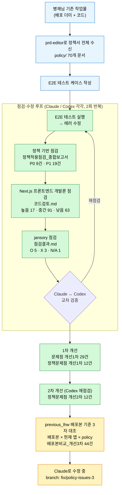
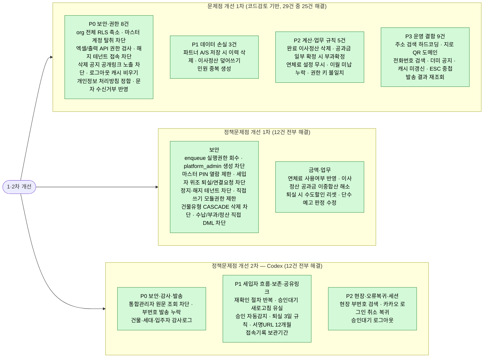
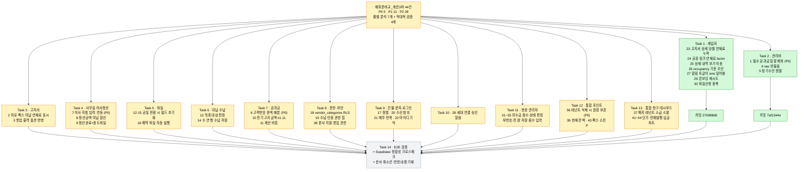

# 주택관리ERP 작업 흐름도 (Notion용 Mermaid)

## 1. 전체 작업 흐름

```mermaid
flowchart TD
    A["병재님 기존 작업물<br/>(배포 더미 + 코드)"] --> B["prd-editor로 정책서 전체 수신<br/>policy/ 70개 문서"]
    B --> C["E2E 테스트 케이스 작성"]

    subgraph LOOP["점검·수정 루프 (Claude / Codex 각각, 2회 반복)"]
        direction TB
        D["E2E 테스트 실행<br/>→ 에러 수정"]
        E["정책 기반 점검<br/>정책적용점검_종합보고서<br/>P0 9건 · P1 19건"]
        F["Next.js 프론트엔드 개발론 점검<br/>코드검토.md<br/>높음 17 · 중간 91 · 낮음 63"]
        G["jansory 점검<br/>점검결과.md<br/>O 5 · X 3 · N/A 1"]
        H{"Claude ↔ Codex<br/>교차 검증"}
        D --> E --> F --> G --> H
        H -- "재점검" --> D
    end

    C --> D
    H --> I["1차 개선<br/>문제점 개선1차 29건<br/>정책문제점 개선1차 12건"]
    I --> J["2차 개선 (Codex 재점검)<br/>정책문제점 개선2차 12건"]
    J --> K["previous_lhw 배포본 기준 3자 대조<br/>배포본 × 현재 앱 × policy<br/>배포본비교_개선3차 44건"]
    K --> L["Claude로 수정 중<br/>branch: fix/policy-issues-3"]

    classDef done fill:#d3f9d8,stroke:#2b8a3e,color:#000
    classDef doing fill:#fff3bf,stroke:#e67700,color:#000
    classDef src fill:#e7f5ff,stroke:#1971c2,color:#000
    class A,B,C src
    class D,E,F,G,I,J done
    class K,L doing
```

## 2. 1차·2차 개선 — 무엇을 고쳤나

```mermaid
flowchart LR
    ROOT(["1·2차 개선"])

    subgraph R1["문제점 개선 1차 (코드검토 기반, 29건 중 25건 해결)"]
        direction TB
        R1a["P0 보안·권한 8건<br/>org 전체 RLS 축소 · 마스터 계정 탈취 차단<br/>엑셀/출력 API 권한 검사 · 해지 테넌트 접속 차단<br/>삭제 공지 공개링크 노출 차단 · 로그아웃 캐시 비우기<br/>개인정보 처리방침 정합 · 문자 수신거부 반영"]
        R1b["P1 데이터 손실 3건<br/>파트너 A/S 저장 시 이력 삭제 · 이사정산 덮어쓰기<br/>민원 중복 생성"]
        R1c["P2 계산·업무 규칙 5건<br/>완료 이사정산 삭제 · 공과금 일부 확정 시 부과확정<br/>연체료 설정 무시 · 이월 미납 누락 · 권한 키 불일치"]
        R1d["P3 운영 결함 9건<br/>주소 검색 하드코딩 · 지로 QR 도메인<br/>전화번호 검색 · 더미 공지 · 캐시 미갱신 · ESC 중첩<br/>발송 결과 재조회"]
    end

    subgraph R2["정책문제점 개선 1차 (12건 전부 해결)"]
        direction TB
        R2a["보안<br/>enqueue 실행권한 회수 · platform_admin 생성 차단<br/>마스터 PIN 열람 제한 · 세입자 위조 퇴실/연결요청 차단<br/>정지·해지 테넌트 차단 · 직접 쓰기 모듈권한 제한<br/>건물유형 CASCADE 삭제 차단 · 수납/부과/정산 직접 DML 차단"]
        R2b["금액·업무<br/>연체료 사용여부 반영 · 이사정산 공과금 이중합산 해소<br/>퇴실 시 수도할인 리셋 · 단수 예고 판정 수정"]
    end

    subgraph R3["정책문제점 개선 2차 — Codex (12건 전부 해결)"]
        direction TB
        R3a["P0 보안·감사·발송<br/>통합관리자 원문 조회 차단 · 부번호 발송 누락<br/>건물·세대·입주자 감사로그"]
        R3b["P1 세입자 흐름·보존·공유링크<br/>재확인 절차 반복 · 승인대기 새로고침 유실<br/>승인 자동감지 · 퇴실 3일 규칙 · 서명URL 12개월<br/>접속기록 보관기간"]
        R3c["P2 현장·오류복귀·세션<br/>현장 부번호 검색 · 카카오 로그인 취소 복귀<br/>승인대기 로그아웃"]
    end

    ROOT --> R1
    ROOT --> R2
    ROOT --> R3

    classDef done fill:#d3f9d8,stroke:#2b8a3e,color:#000
    class R1a,R1b,R1c,R1d,R2a,R2b,R3a,R3b,R3c done
```

## 3. 3차 — 배포본(previous_lhw) 비교 수정 진행 현황

```mermaid
flowchart TD
    S["배포본비교_개선3차 44건<br/>P0 5 · P1 11 · P2 28<br/>롤별 분석 7개 + 적대적 검증 4개"]

    S --> T1["Task 1 · 세입자<br/>23 고지서 상세 당월 연체료 누락<br/>24 공유 링크 연체료 factor<br/>25 상세 내역 보기 이동<br/>26 occupancy 기준 조인<br/>27 알림 토글이 sms 덮어씀<br/>29 온보딩 재시도<br/>30 퇴실신청 중복"]
    S --> T2["Task 2 · 관리비<br/>1 필수 공과금 일할 제외 (P0)<br/>4 raw 반올림<br/>5 장기수선 정렬"]
    S --> T3["Task 3 · 고지서<br/>2 지로·팩스 미납·연체료 표시<br/>3 셋업 출력 옵션 반영"]
    S --> T4["Task 4 · 사무실 이사정산<br/>7 이사 지침 입력·연동 (P0)<br/>8 정산금액 미납 합산<br/>9 정산완료+중도퇴실"]
    S --> T5["Task 5 · 퇴실<br/>12·15 공실 전환 시 필드 초기화<br/>16 예약 퇴실 자동 실행"]
    S --> T6["Task 6 · 미납·수납<br/>13 독촉 대상 판정<br/>14 수.연 행 수납 저장"]
    S --> T7["Task 7 · 공과금<br/>6 고객번호 총액 배분 (P0)<br/>10 전기 고지금액 x1.11<br/>11 계산 버튼"]
    S --> T8["Task 8 · 권한·보안<br/>18 vendor_categories RLS<br/>19 수납·민원 권한 칩<br/>38 본사 지원·영업 권한"]
    S --> T9["Task 9 · 건물·문자·로그인<br/>17 정렬 · 20 수신 범위<br/>21 매주 반복 · 22 아이디 기억"]
    S --> T10["Task 10 · 28 세대 연결 승인 알림"]
    S --> T11["Task 11 · 현장 관리자<br/>31~35 미수금 음수·상태 판정<br/>부번호·전.량 저장·음수 입력"]
    S --> T12["Task 12 · 통합 포인트<br/>36 테넌트 삭제 시 원장 보존 (P0)<br/>39 현재 잔액 · 40 팩스 소진 P"]
    S --> T13["Task 13 · 통합 청구·대시보드<br/>37 해지 테넌트 소급 소멸<br/>41~44 단가·전체발행·입금·차트"]

    T1 --> C1["커밋 270088d6"]
    T2 --> C2["커밋 7af1344e"]

    T3 & T4 & T5 & T6 & T7 & T8 & T9 & T10 & T11 & T12 & T13 --> Z["Task 14 · E2E 검증<br/>+ Supabase 정합성 크로스체크<br/>+ 문서 취소선·반영 내용 기재"]
    C1 & C2 --> Z

    classDef done fill:#d3f9d8,stroke:#2b8a3e,color:#000
    classDef doing fill:#fff3bf,stroke:#e67700,color:#000
    classDef todo fill:#f1f3f5,stroke:#868e96,color:#000
    class T1,T2,C1,C2 done
    class S,T3,T4,T5,T6,T7,T8,T9,T10,T11,T12,T13 doing
    class Z todo
```

범례: 초록 = 완료 · 노랑 = 진행 중 · 회색 = 예정
